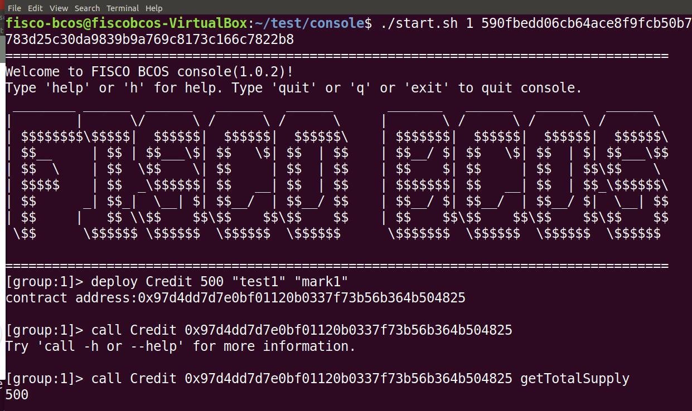

## 僵尸游戏熟悉solidity规则


通过僵尸游戏大致了解了Solidity语言

#### 数据类型

true / false

uint(8、16、32.....256)

string

bytes

#### 数组

uint[]

#### 结构体struct

 struct User {
      string name;
      uint age;
    }

#### 函数

四种作用域

public
private
internal
external

#### memory&storage

memory可回收，暂时性，函数调用结束后则消失

storage（默认的状态变量）永远写入区块链，无法更改且永久存在

##### 函数修改器 modifier

修改器是一种合约属性，可被继承可重写。


## 部署LAG积分合约（控制台）

#### 编写合约

```
pragma solidity ^0.4.24;

contract LAG{
    string name="LAGC";
    string symbol="LAG";
    uint256 totalSupply;
    
    mapping(address=>uint256) private balances;
    event transferEvent(address from, address to, uint256 value);
    
    constructor(uint256 initialSupply, string CreditName, string CreditSymbol) public{
        totalSupply=initialSupply;
        balances[msg.sender]=totalSupply;
        name=CreditName;
        symbol=CreditSymbol;
    }
    function getTotalSupply() constant public returns (uint256){
        return totalSupply;
    }
    function _transfer(address _from, address _to, uint256 _value) internal{
        require(_to!=0x0);
        require(balances[_from]>=_value);
        require(balances[_from]+_value>=balances[_from]);
        uint previousBalances=balances[_from]+balances[_to];
        
        balances[_from]-=_value;
        balances[_to]+=_value;
        
        emit transferEvent(_from,_to,_value);
        assert(balances[_from]+balances[_to]==previousBalances);
    }
    function transfer(address _to, uint256 _value) public {
		_transfer(msg.sender, _to, _value);
	}
    function balanceOf(address _owner) constant public returns (uint256){
        return balances[_owner];
    }
}
```

#### 部署与测试

创建商家账号


使用私钥登录

部署积分合约，总积分500

显示总积分




创建用户账户


在商家账户的控制台中分配积分并查看


